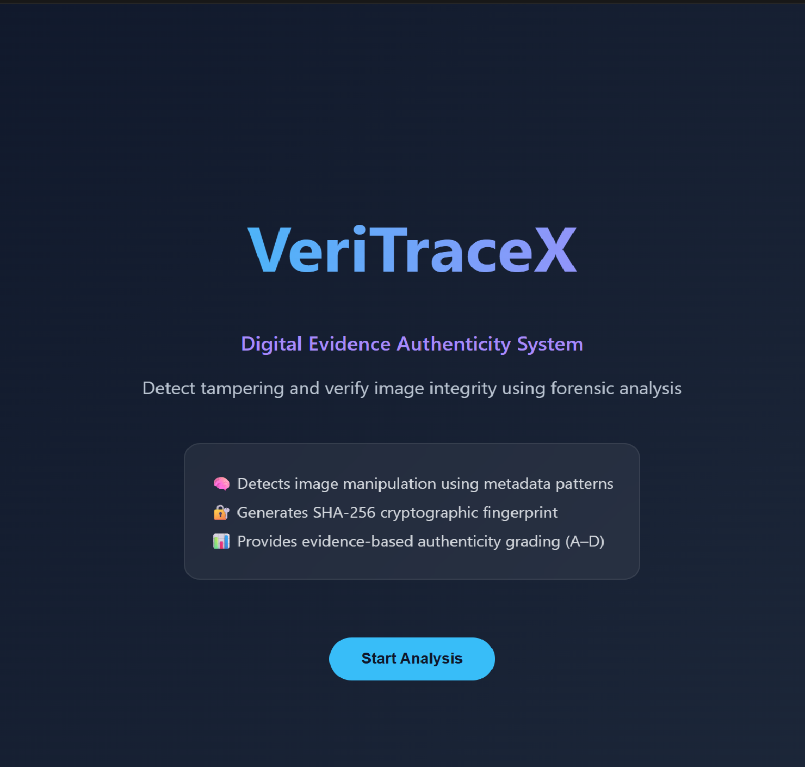
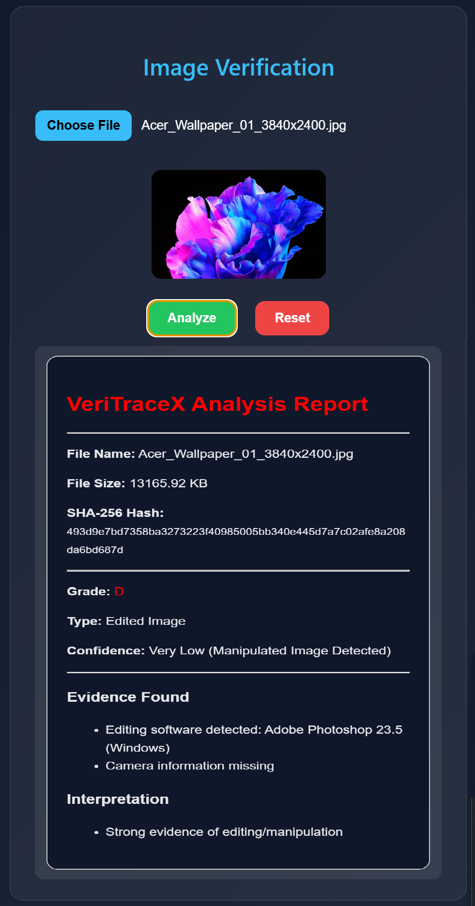

<h1 align="center"> VeriTraceX – Digital Evidence Authenticity Grading System</h1>

A web-based forensic tool that analyzes image authenticity using metadata inspection and cryptographic hashing.

---

## 📌 Overview

VeriTraceX is a lightweight digital forensics prototype designed to evaluate whether an image has been altered or remains original.  
It uses **EXIF metadata analysis** and **SHA-256 hashing** to detect manipulation signals and generate an authenticity grade.

This project was built as a **college micro-project** to demonstrate foundational concepts in digital forensics and file integrity verification.

---

## 🚀 Features

- 📂 Upload and preview images instantly  
- 🧠 Extract and analyze EXIF metadata  
- 🔐 Generate SHA-256 hash for file integrity check  
- 📊 Authenticity grading system (A–D)  
- ⚠️ Evidence-based detection logic  
- 📄 Detailed forensic-style report  
- 🔄 Reset and re-analyze functionality  

---

## 🛠️ Tech Stack

- HTML5  
- CSS3  
- JavaScript (Vanilla)  
- EXIF.js  
- CryptoJS  

---

## ⚙️ Working Flow

1. Upload an image  
2. Preview is displayed instantly  
3. EXIF metadata is extracted  
4. SHA-256 hash is generated  
5. System evaluates authenticity signals  
6. Image is classified into a grade:

   - 🟢 **A** → Original / High confidence  
   - 🟡 **B** → Slight processing detected  
   - 🟠 **C** → Uncertain authenticity  
   - 🔴 **D** → Likely manipulated  

7. Final forensic report is generated  

---

## 📊 Grading System

| Grade | Meaning |
|------|--------|
| A | High confidence – Original image |
| B | Medium confidence – Slight processing |
| C | Low confidence – Uncertain authenticity |
| D | Very low confidence – Likely manipulated |

---

## 📸 Screenshots

### 🏠 Dashboard

  

### 📊 Analysis Report

  

---

## 🚀 Future Improvements

- 🤖 AI-based image forgery detection  
- 🧠 Deepfake detection module  
- 🗄️ Database integration for case history  
- 🔬 Advanced forensic analysis engine  
- 📱 Mobile-responsive UI upgrade  

---

## 👩‍💻 Developed By

- Pragya Kumre  
- Namami Tiwari  

---

## ⭐ Note

This project is a **prototype built for learning purposes**, focused on:
- Digital forensics basics  
- Image authenticity verification  
- Cryptographic hashing techniques  

---

✨ Built for learning | Exploring digital forensics ✨

